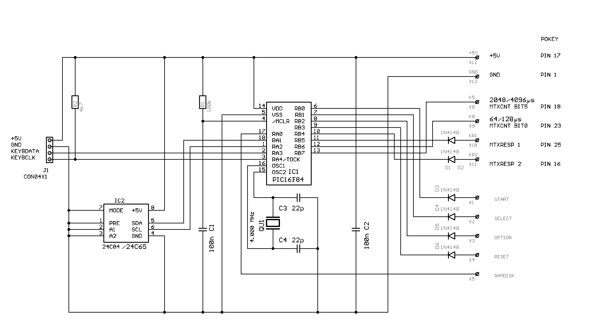
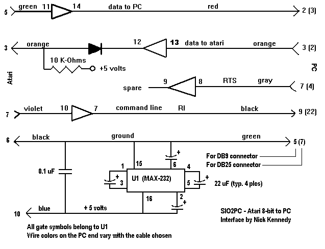

# Atari 600XL Upgrades
A 16KB Atari 600XL was upgraded during 2015/2016 with the following additions and modifications:
1. PS/2 Keyboard
2. PC RS232 interface for file storage
3. 64k RAM memory upgrade
4. Composite video output upgrade
5. 5 volt PSU upgrade

### Completed upgraded Atari 600XL

  
 

### 64k RAM Memory upgrade 
Refer to 600XLRam.png for the original Atari 600XL 16kB RAM schematic. Also read 64kRAMUpgrade.txt - modification is adapted from the February 1988 issue of the Michigan Atari Magazine article by Don Neff. Atari SIG Historical Archive has the reference:
https://www.atarimax.com/freenet/freenet_material/5.8-BitComputersSupportArea/7.TechnicalResourceCenter/showarticle.php?40

1. Replace two existing 16kx4 dram chips with two 41464-10 64K X 4 bit Dram chips
2. Bend up three IC pins (U11 74LS51 pin 8, U5 74LS158 pin 3, U6 74LS158 pin 10
3. Unsolder one 33 ohm resistor pin R36
4. Add 3 jumper wires (yellow, red and blue in photo)

  
 

  
 

### PS/2 Keyboard upgrade (PIC16F84A) 
Note an open-source version of PIC16F84AKI.hex is provided in the file MageAKI1.asm.
Schematic as below - the EEPROM is not required for operation. Refer to 600XLKeyboard.png for the original Atari 600XL keyboard schematic.
Refer to https://www.microchip.com/forums/m675230.aspx and https://atariage.com/forums/topic/183498-ps2-keyboard-with-8-bits/ for sources and acknowledgments.
Refer to PC2AtariKeys.txt for the Key Maps. The two CD4051 IC 8-way switches were removed and connections to the PIC16F84A made through two 16 pin IC socket headers.

  
 

  
 

  
  

  
   

### PC RS232 interface upgrade (MAX232)
SIO2PC (source: Nick Kennedy at http://pages.suddenlink.net/wa5bdu/sio2pc.htm) is a hardware & software package interfacing the 8-bit Atari to PC compatible computers. The PC emulates Atari disk drives so Atari programs could be stored on the PC's hard drives. A hardware device to convert logic levels was also necessary. This MAX232 device is now commonly referred to as an SIO2PC cable - for pinout details refer to SIO2PCPinouts.txt. The software emulation drivers can be downloaded from the link given. It features:
* Emulates 1 to 4 Atari disk drives
* Store your Atari files on PC hard or floppy drives
* Boot from the PC, real drive not needed to start-up
* No software or drivers required for the Atari; no conflicts: use your favorite DOS
* Twice as fast as an Atari 810 drive and more reliable
* Co-exists with real drives in the Atari daisy chain
* Compatible down to the hardware level: use sector copiers, etc.
* Print-Thru captures Atari print-out and routes to PC's printer
* Convert Atari files to PC files and vice versa
* 1050-2-PC version connects PC directly to Atari disk drive

  
 

  
 

  
   
  
### Video output upgrade

  
 
  
 ### PSU upgrade

  
 
  
More details to follow....
