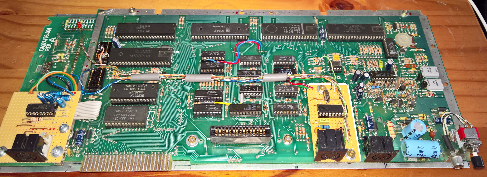
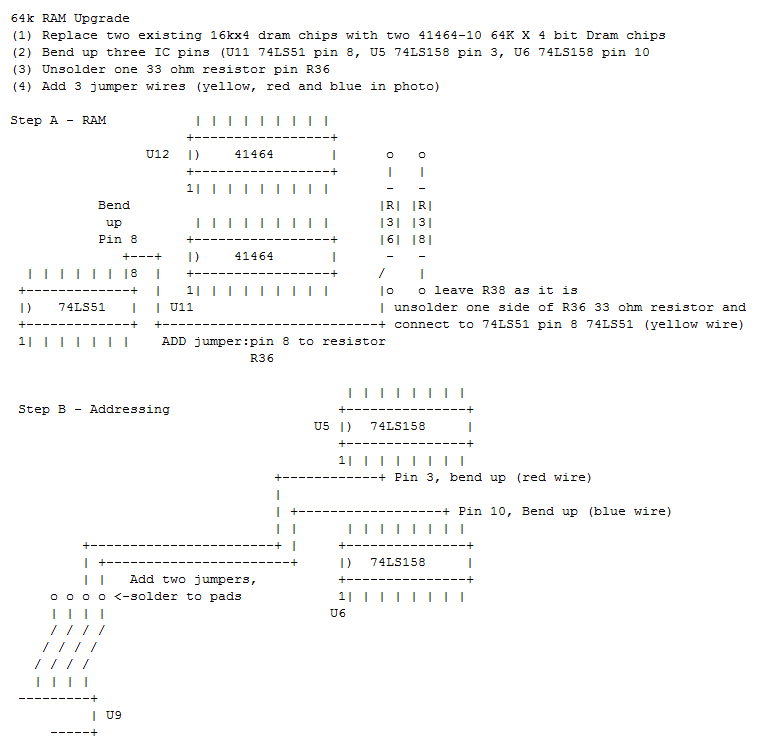
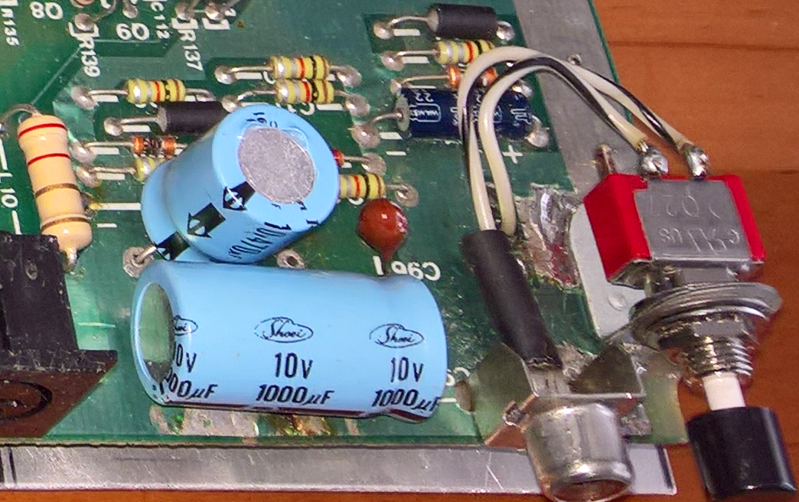

# Atari600XL-Upgrades
A 16KB Atari 600XL was upgraded during 2015/2016 with the following additions and modifications:

### Completed upgraded Atari 600XL

  
 

### 64k RAM Memory upgrade 
Also read 64kRAMUpgrade.txt 
(1) Replace two existing 16kx4 dram chips with two 41464-10 64K X 4 bit Dram chips 
(2) Bend up three IC pins (U11 74LS51 pin 8, U5 74LS158 pin 3, U6 74LS158 pin 10 
(3) Unsolder one 33 ohm resistor pin R36 
(4) Add 3 jumper wires (yellow, red and blue in photo) 

  
 

  
 

### PS/2 Keyboard upgrade (PIC16F84) 
Note open-source version of AKI.hex provided in file MageAKI1.asm

  
 

  
  

  
   

### PC RS232 interface upgrade (MAX232)

  
 

  
   
  
### Video output upgrade

  
 
  
 ### PSU upgrade

  
 
  
More details to follow....
