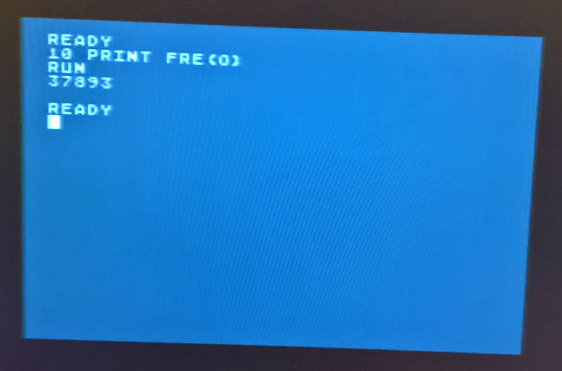
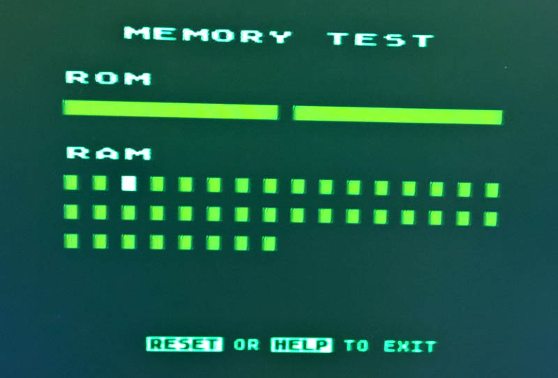
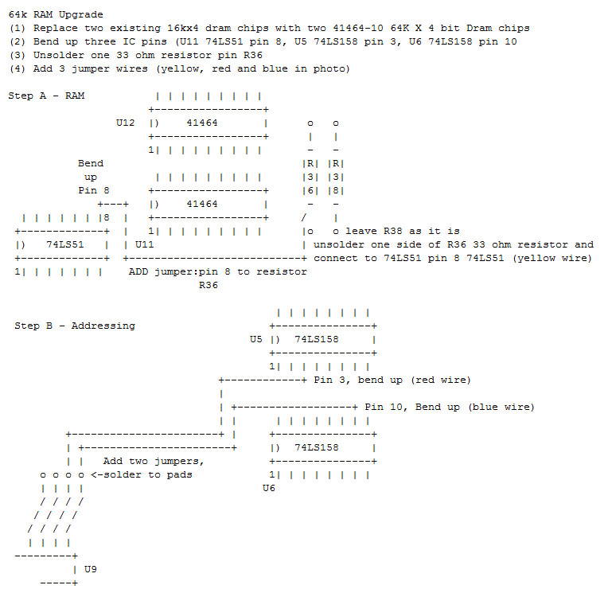
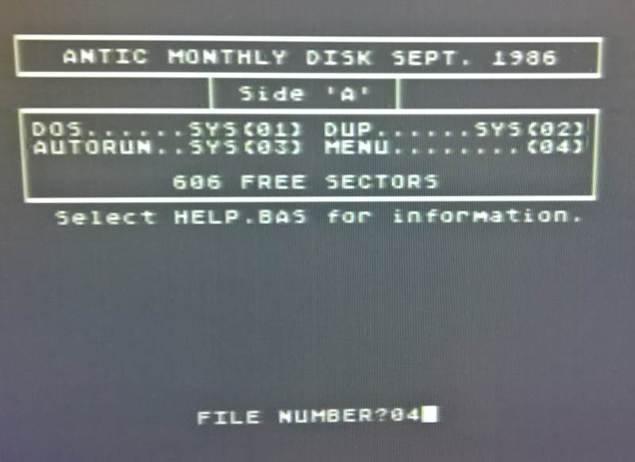
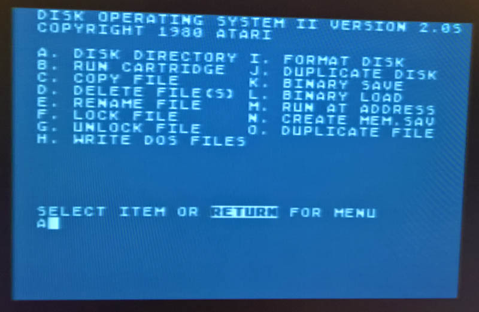
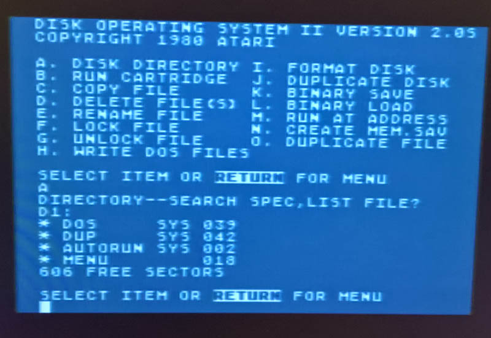
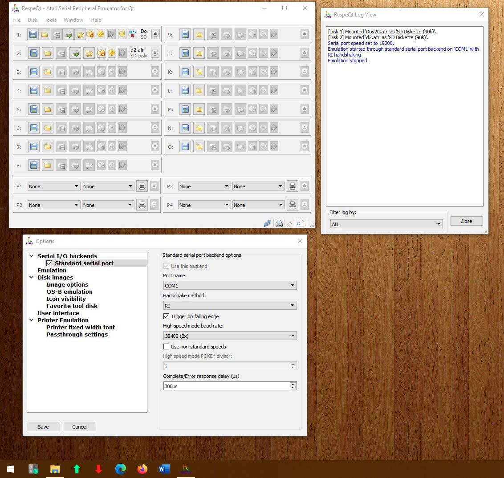
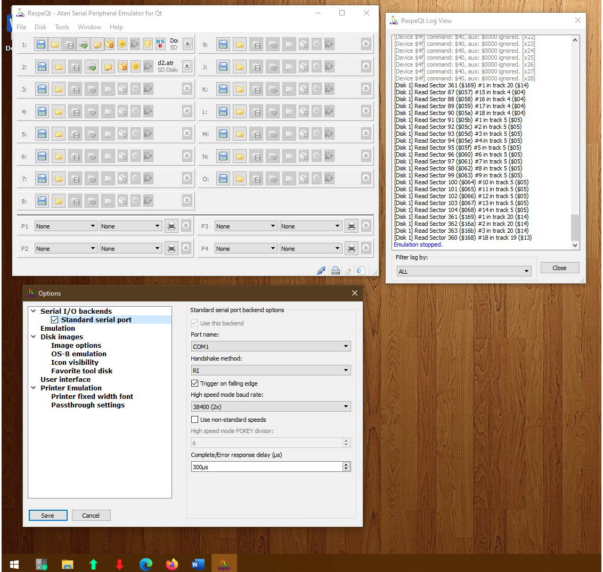

# Atari 600XL Upgrades
A 16KB Atari 600XL was upgraded during 2015/2016 with the following additions and modifications:
1. PS/2 Keyboard
2. PC RS232 interface for file storage
3. 64k RAM memory upgrade
4. Composite video output upgrade
5. 5 volt PSU upgrade

Note that all the integrated circuits are socketed - even audio Pokey chip - [**see this post in the Teensy forum**](https://forum.pjrc.com/threads/70140-quot-Using-quot-an-Atari-Pokey-Chip-with-a-Teensy-4-or-4-1?p=305572&viewfull=1#post305572) - *I look forward to seeing what you create. I was considering snagging a couple to play around with myself, but christ are they expensive. So much so that 400/800/1200XL motherboards on eBay usually come without the POKEY, which is sold separately because $$$.*

### Completed upgraded Atari 600XL

  
 

### 64k RAM Memory upgrade 
  Refer to [**600XLRam.jpg**](https://github.com/TobiasVanDyk/Atari600XL-Upgrades/blob/master/images/600XLRam.jpg) for the original Atari 600XL 16kB RAM schematic. Also read 64kRAMUpgrade.txt - modification is adapted from the February 1988 issue of the Michigan Atari Magazine article by Don Neff. Atari SIG Historical Archive has the reference: [**Michigan Atari Magazine**](https://www.atarimax.com/freenet/freenet_material/5.8-BitComputersSupportArea/7.TechnicalResourceCenter/showarticle.php?40)

1. Replace two existing 16kx4 dram chips with two 41464-10 64K X 4 bit Dram chips
2. Bend up three IC pins (U11 74LS51 pin 8, U5 74LS158 pin 3, U6 74LS158 pin 10
3. Unsolder one 33 ohm resistor pin R36
4. Add 3 jumper wires (yellow, red and blue in photo)

The schematic of the RAM upgrade is as below - [**I LOVE ASCII schematics**](https://github.com/TobiasVanDyk/Atari600XL-Upgrades/blob/master/64kRAMUpgrade.txt).

  
 

  
 

### PS/2 Keyboard upgrade (PIC16F84A) 
Note an open-source version of PIC16F84AKI.hex is provided in the file MageAKI1.asm.
Schematic as below - the EEPROM is not required for operation. Refer to [**600XLKeyboard.jpg**](https://github.com/TobiasVanDyk/Atari600XL-Upgrades/blob/master/images/600XLKeyboard.jpg) for the original Atari 600XL keyboard schematic.
Refer to [**MicrochipForums**](https://www.microchip.com/forums/m675230.aspx) and [**AtariAge**](https://atariage.com/forums/topic/183498-ps2-keyboard-with-8-bits/) for sources and acknowledgments.
Refer to PC2AtariKeys.txt for the Key Maps. The two CD4051 IC 8-way switches were removed and connections to the PIC16F84A made through two 16 pin IC socket headers.

  
 

  
  
  
   

### PC RS232 interface upgrade (MAX232)
SIO2PC (source: Nick Kennedy at [**SIOPC**](http://pages.suddenlink.net/wa5bdu/sio2pc.htm) is a hardware & software package interfacing the 8-bit Atari to PC compatible computers. The PC emulates Atari disk drives so Atari programs could be stored on the PC's hard drives. A hardware device to convert logic levels was also necessary. This MAX232 device is now commonly referred to as an SIO2PC cable - for pinout details refer to SIO2PCPinouts.txt. The software emulation drivers can be downloaded from the link given. It features:
* Emulates 1 to 4 Atari disk drives
* Store your Atari files on PC hard or floppy drives
* Boot from the PC, real drive not needed to start-up
* No software or drivers required for the Atari; no conflicts: use your favorite DOS
* Twice as fast as an Atari 810 drive and more reliable
* Co-exists with real drives in the Atari daisy chain
* Compatible down to the hardware level: use sector copiers, etc.
* Print-Thru captures Atari print-out and routes to PC's printer
* Convert Atari files to PC files and vice versa
* 1050-2-PC version connects PC directly to Atari disk drive

  
 

  
  
   

A modern alternative is [**RespeQt an Atari Serial Peripheral Emulator for Qt**](https://github.com/RespeQt/RespeQt). It works with the same RS232 cable as described above. To use it in Windows 10:

1.	Extract RespeQt-r5.3-64bits.zip to C:\Programs\Atari RespectQt
2.	Run RespeQt.exe in subfolder as admin or via desktop shortcut as admin.
3.	Select Dos20.atr (Atari Magazine Dos Disk from 1986) using COM1 to COMx, and x2 speed RTI falling edge (Use Options menu for this)
4.	 Connect RS232 cable from PC COM port into Atari port and switch Atari on - will get blue screen saying ready but let it load for a minute or so
5.	 Will then get first menu choose 01 (Dos)
6.	 Then get second menu choose A, then D1: to see the four files on D1
  

  
  
   

  
### Video output upgrade
Details on how to add a composite video output to the Atari 600XL were given in Atari Classics December 1993. [**600XLVideo.pdf**](https://github.com/TobiasVanDyk/Atari600XL-Upgrades/blob/master/600XLVideo.pdf) has two pages from this magazine that list the composite video output modification steps for the 600XL. From the photos on this page, it will be noticed that the RF modulator module was removed from the 600XL motherboard, and the space created used for the PS/2 PIC interface. [**600XLVideo.jpg**](https://github.com/TobiasVanDyk/Atari600XL-Upgrades/blob/master/images/600XLVideo.jpg) shows the original Atari 600XL video conditioning schematic - and based on this schematic it is worth testing the two video outputs "composite" and "video RF", through a suitable resistor (220 ohms or less), before embarking on the extensive modifications as outlined in the  1993 article. Refer to the photo at the end for a photo of the easy single resistor, video output.  

  
 
  
 ### PSU upgrade

  
 
  
 ### Real versus simulated Atari Graphics Mode 0
 Graphics Mode 0 (ANTIC 2) This is the normal-sized character or text mode that the computer defaults to on start up. Being a character mode, screen memory consists of bytes that represent individual characters in either the ROM or a custom character set. ANTIC displays forty of these 8 x 8 sized characters on each of twenty-four lines. For the fidelity of a simulation refer to the repository [**Teensy4Atari**](https://github.com/TobiasVanDyk/Teensy4Atari). The two missing character columns is the result of the operating system leaving a two character-wide border on the left.

  
 

